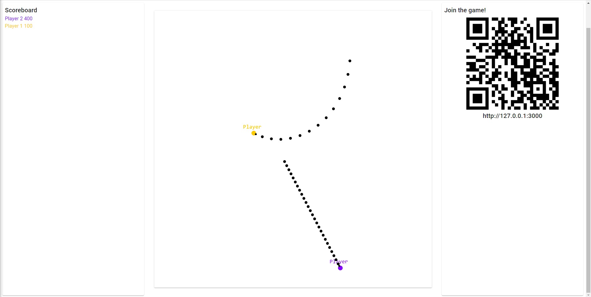
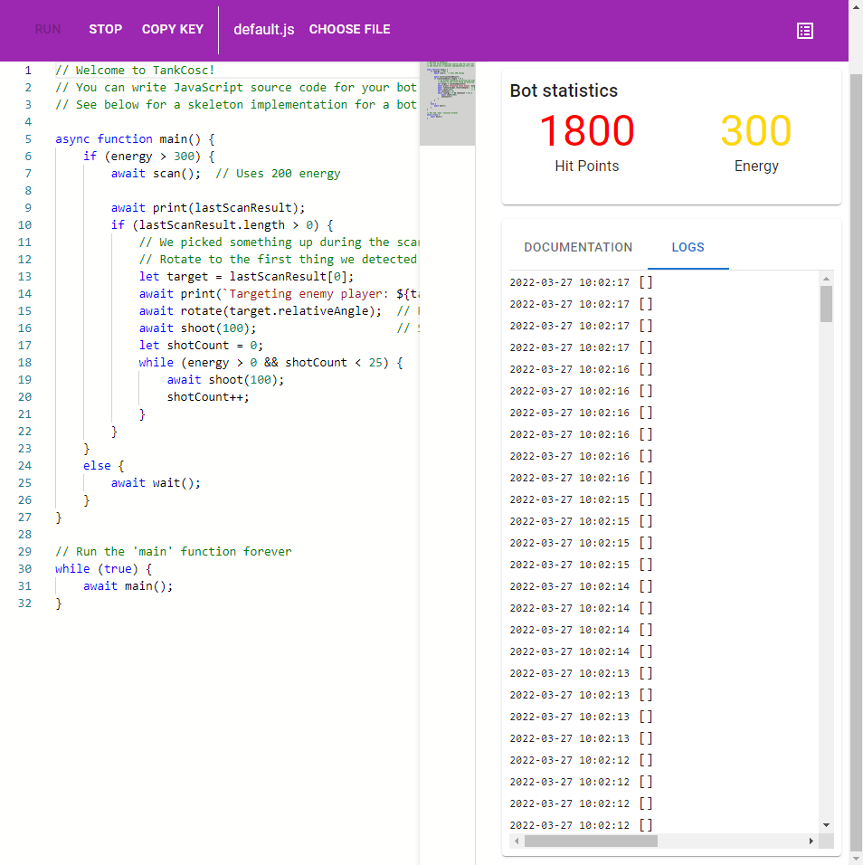
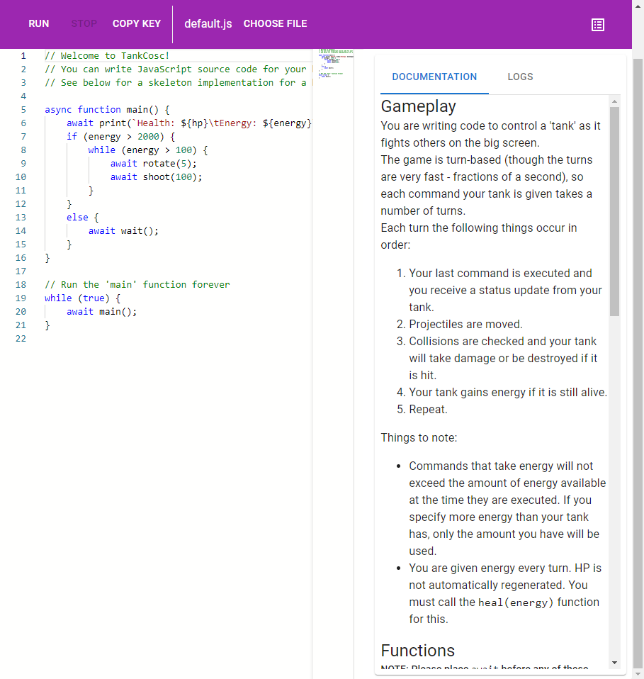

# TankCOSC

A competitive programming game.

## What is it though?

TankCOSC is designed to be played as an event with all players in the same room and the 'board' projected onto a screen that everyone can see. The board shows both a leaderboard and a live view of the state of play.

Players can join the game and write custom code to control their tank on the board, earning points by destroying competitors' tanks. The API provided is very loose and intuitive, allowing for complex and divergent playing styles to be explored by players. Players can write and execute their code in a 'playground' environment in the browser (this is limited to JavaScript code), but in future a [CLI](cli) will allow players to write code in any language, communicating with the game server by simply using stdin/stdout.

But that's all a bit high-level... What does gameplay actually look like? Check out this demo recording:

### Screenshots

#### Game Board

#### Playground

Playground while the bot is running:

Playground with built-in coding documentation:

